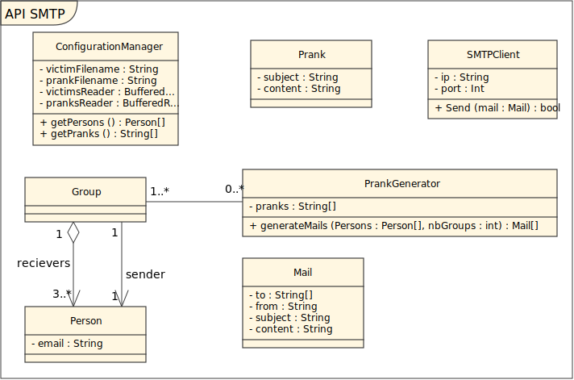

# API-2021-SMTP

Dans le cadre du cours API à l'HEIG-VD, nous avons implémenté un client SMTP dont l'objectif est d'envoyer des mails pranks à une liste de contacts.
Il est possible de modifier la liste des contacts ainsi que des messages en modifiant les fichiers [victims.txt](victims.txt) et [pranks.txt](pranks.txt).

Les victimes sont divisées en le nombre de groupe passé par paramètre au programme et un message (choisi au hasard dans la liste des pranks) est envoyé par mail à toutes les victimes du groupe.

## MockMock

MockMock est un outil qui simule un serveur SMTP. Il permet de tester un client SMTP et offre une interface permettant de visualiser les mails envoyés.

Si vous désirez tester notre client sur le faux serveur SMPT MockMock, veuillez suivre les étapes suivantes...

## Installation de MockMock
Prérequis: Docker
### Etapes:

Rendez vous dans le dossier docker :
```
cd ./docker
```

Créer un container:
```
docker build --pull --rm -f "Dockerfile" -t mockmock:latest "."
```

Lancer le container
```
docker run -p 8282:8282 -p 25:25 mockmock:latest
```
### UI de MockMock

Pour accéder à l'interface utilisateur de MockMock, rendez-vous à cette adresse: [http://localhost:8282](http://localhost:8282)

## Comment utiliser notre client SMTP

### Victimes
Pour ajouter ou modifier les adresses mails des victimes, modifiez le fichier [victims.txt](victims.txt) en respectant ces règles :
1. Une victime par ligne
2. Renseigner uniquement l'adresse mail

```
exemple1@gmail.com
exemple2@heig-vd.ch
```

### Messages de prank
Pour ajouter ou modifier les messages de prank, modifiez le fichier [pranks.txt](pranks.txt) en respectant ces règles :
1. Séparer les message par un retour à la ligne, `==` puis un retour à la ligne.
2. Définir le sujet en le préfixant par le mot clé `Subject:` suivi d'un retour à la ligne.

```
Subject:Ceci est un autre sujet test

Mon frère est allé acheter une banane à supermarché.

Elle n'était pas bonne...
Malheureusement
==
Subject:blablabl

Aujourd'hui est un grand jour, je vends enfin mon poisson rouge Didier.
J'en pouvais plus de lui il était trop bruyant et il faisait des trous dans mes chaussettes.

A qui mieux mieux
```

### Informations de connexion au serveur
Le Main de notre projet prend les informations suivantes en paramètre (dans le même ordre) :
1. l'adresse ip du serveur
2. le port du serveur
3. le nombre de groupe à créer 
4. l'identifiant de l'utilisateur (facultatif)
5. le mot de passe de l'utilisateur (facultatif)

Les trois premiers paramètres sont obligatoires et les deux dernier dépendent du besoin d'identification du serveur (c'est le cas avec mailtrap par exemple).

Pour se connecter à notre serveur MockMock introduit ci-dessus, l'adresse ip à entrer est "localhost" et le numéro de port est 25 et aucune identification n'est requise.


## Description de notre implémentation


Nous avons choisi de séparer le parsing des fichiers de victimes et de messages de pranks et la connexion au serveur SMTP.

### Construction des messages et de la liste de victimes
La classe ConfigurationManager s'occupe de de parser les fichiers [victims.txt](victims.txt) et [pranks.txt](pranks.txt) et de créer des objets de type Prank et Person.
Ces informations sont transmises au PrankGenerator avec le nombres de groupes à créer et ce dernier construit les groupes et les mail et assigne à chaque groupe un mail.

### Construction du client SMTP
La classe SMTPCLient construit un client SMTP, établit une connexion avec le serveur SMTP dont les informations lui sont passées par paramètre et envoie le mail qui lui est également passé par paramètre. 
